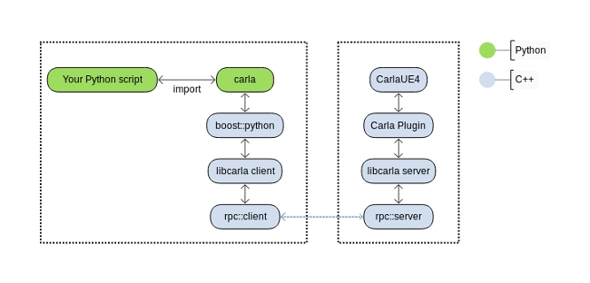

# Build system

* [__Setup__](#setup)  
* [__LibCarla__](#libcarla)  
* [__CarlaUnreal and Carla plugin__](#carlaue4-and-carla-plugin)  
* [__PythonAPI__](#pythonapi)
    - [Versions 0.9.12+](#versions-0912)
    - [Versions prior to 0.9.12](#versions-prior-to-0912)

> _This document is a work in progress, only the Linux build system is taken into account here._

The most challenging part of the setup is to compile all the dependencies and modules to be compatible with a) Unreal Engine in the server-side, and b) Python in the client-side.

The goal is to be able to call Unreal Engine's functions from a separate Python process.



In Linux, we compile CARLA and all the dependencies with clang-8.0 and C++14 standard. We however link against different runtime C++ libraries depending on where the code going to be used, since all the code that is going to be linked with Unreal Engine needs to be compiled using `libc++`.

---
## Setup

Command

```sh
make setup
```

Get and compile dependencies

  * llvm-8 (libc++ and libc++abi)
  * rpclib-2.2.1 (twice, with libstdc++ and libc++)
  * boost-1.72.0 (headers and boost_python for libstdc++)
  * googletest-1.8.1 (with libc++)

---
## LibCarla

Compiled with CMake (minimum version required CMake 3.9).

Command

```sh
make LibCarla
```

Two configurations:


|  | Server | Client |
| ---------- | ---------- | ---------- |
| **Unit tests**        | Yes                   | No                    |
| **Requirements**      | rpclib, gtest, boost  | rpclib, boost         |
| **std runtime**       | LLVM's `libc++`       | Default `libstdc++`   |
| **Output**            | headers and test exes | `ibcarla_client.a`    |
| **Required by**       | Carla plugin          | PythonAPI             |


---
## CarlaUnreal and Carla plugin

Both compiled at the same step with Unreal Engine build tool. They require the `UE4_ROOT` environment variable set.

Command

```sh
make CarlaUnrealEditor
```

To launch Unreal Engine's Editor run

```sh
make launch
```

---
## PythonAPI
### Versions 0.9.12+

Compiled using Python's `setuptools` ("setup.py"). Currently requires the following to be installed in the machine: Python, libpython-dev, and
libboost-python-dev, pip>=20.3, wheel, and auditwheel.

Command:

```sh
make PythonAPI
```

Creates two files that each contain the client library and correspond to the supported Python version on the system. One file is a `.whl` file and the other is an `.egg` file. This allows for the option of two different, mutually exclusive ways to use the client library. 

>__A. .whl file__

>>The `.whl` is installed using the command:

>>      pip install <wheel_file>.whl

>>There is no need to import the library path directly in scripts as is required in previous versions or `.egg` files (see section [__Versions prior to 0.9.12__](#versions-prior-to-0912)); `import carla` is sufficient.

>__B. .egg file__

>>See the section [__Versions prior to 0.9.12__](#versions-prior-to-0912) for more information.


### Versions prior to 0.9.12

Compiled using Python's `setuptools` ("setup.py"). Currently requires the following to be installed in the machine: Python, libpython-dev, and
libboost-python-dev.

Command

```sh
make PythonAPI
```

It creates two "egg" packages

  * `PythonAPI/dist/carla-X.X.X-py2.7-linux-x86_64.egg`
  * `PythonAPI/dist/carla-X.X.X-py3.7-linux-x86_64.egg`

This package can be directly imported into a Python script by adding it to the system path.

```python
#!/usr/bin/env python

import sys

sys.path.append(
    'PythonAPI/dist/carla-X.X.X-py%d.%d-linux-x86_64.egg' % (sys.version_info.major,
                                                             sys.version_info.minor))

import carla

# ...
```

Alternatively, it can be installed with `easy_install`

```sh
easy_install2 --user --no-deps PythonAPI/dist/carla-X.X.X-py2.7-linux-x86_64.egg
easy_install3 --user --no-deps PythonAPI/dist/carla-X.X.X-py3.7-linux-x86_64.egg
```
